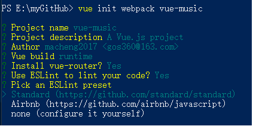
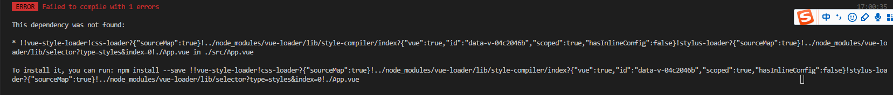
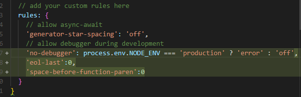

# 使用vue脚手架
### vue init webpack vue-music
>可以帮我们初始化 webpack的配置,

###  由于众所周知的原因，可以考虑切换源为 taobao 源
$ npm set registry https://registry.npm.taobao.org/

  * Runtime + Compiler: recommended for most users
  * Runtime-only: about 6KB lighter min+gzip, but templates (or any Vue-specific HTML)
      are ONLY allowed in .vue files - r
      ender functions are required elsewhere
>
    Runtime + CompilerRuntime-only 小了6k大小省略了一个模板的编译过程,编译过程是在webpack 使用vue-loader编译 .vue 文件的时候做的
    第一个可以不基于.vue文件的开发,可以 运行时编译因为有compiler


下图的 ESLink what?

    eslink 是es6代码风格检查器



* 这个是什么?

Standard (https://github.com/standard/standard)

  Airbnb (https://github.com/airbnb/javascript)
  none (configure it yourself)

目录结构,将脚手架没有创建出来的文件创建出来

.gitkeep 是保证如果是空文件可以上传到GitHub上而不被过滤掉

## 修改App.vue

```javascript
<template>
<div id="app">
hello world
<router-view/>
</div>
</template>

<script type="text/ecmascript-6">

</script>

<style lang="stylus" scoped rel="stylesheet/stylus" >
@import "~common/stylus/variable"
#app {
color:$color-theme
}
</style>
```
### 需要修改的位置
```JavaScript
 <style lang="stylus" scoped rel="stylesheet/stylus" > 这一句加上之后编译器报错
```


* 为什么?
* 原因是我们使用了stylus但是
脚手架不会明确安装stylus 与 stylus-loader
   * npm install stylus --save
   * npm install stylus-loader


>样式文件使用的是
[stylus](https://github.com/stylus/stylus/)

base 是基础的样式文件

```JavaScript
@import "variable.styl"
body, html
line-height: 1
font-family: 'PingFang SC', 'STHeitiSC-Light', 'Helvetica-Light', arial, sans-serif, 'Droid Sans Fallback'
user-select: none
-webkit-tap-highlight-color: transparent
background: $color-background
color: $color-text
```
>为什么要使用stylus编写css样式?
>
>参考官方文档

定义颜色规范 字体规范

## 修改eslink

* 不检测文件末尾有空行
* 在左括号前面加上空格
     'eol-last':0,
     'space-before-function-paren':0




> 在webpack.base.conf.js 配置了别名alisa

```JavaScript
  resolve: {
    extensions: ['.js', '.vue', '.json'],
    alias: {
      '@': resolve('src'),
      'common':resolve('src/common'),
    }
  },
```
    'common':resolve('src/common'),


### 好了运行npm run dev 试试


