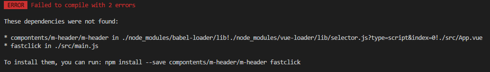

index.html

**移动端的惯例添加**
```JavaScript
 <meta name="viewport" content="width=device-width,initial-scale=1.0,maximum-scale=1.0,minimum-scale=1.0,user-scalable=no">
 ```
>- width - viewport的宽度 height - viewport的高度
>- initial-scale - 初始的缩放比例
>- minimum-scale - 允许用户缩放到的最小比例
>- maximum-scale - 允许用户缩放到的最大比例
>- user-scalable - 用户是否可以手动缩放

[在移动浏览器中使用viewport元标签控制布局](https://developer.mozilla.org/zh-CN/docs/Mobile/Viewport_meta_tag)

[viewport标签](https://www.cnblogs.com/2050/p/3877280.html)

### 添加依赖
package.json

- babel-runtime
- fastclick [解决移动端点击300毫秒延迟](https://www.jianshu.com/p/16d3e4f9b2a9)
- babel-polyfill 对es6的api进行转义例如promise

>问题什么是babel?

[babel](http://www.ruanyifeng.com/blog/2016/01/babel.html)

>npm i babel-runtime fastclick babel-polyfill

      在main.js 中import babel-polyfill

```JavaScript
import 'babel-polyfill' //一定要写到最开始的 babel-runtime 是不用写在代码中,在编译过程中自动调用
import fastclick from 'fastclick'
/* 去掉300毫秒的延时 */
fastclick.attach(document.body)//推荐用法
```
  [fastclick参考](https://github.com/ftlabs/fastclick)

#   实现m-header组件
*  位置
    *  ./components/m-header/


variable 中定义了一些通用的规范 字体 颜色,导入之后就可以用了(例如:$color-background)

mixin 中定义了一些方法 bg-img 将logo图片导入

在APP.vue 引入组件m-header.vue

```JavaScript
<template>
  <div id="app">
      <m-header></m-header>
    <!-- <router-view/> -->
  </div>
</template>

<script type="text/ecmascript-6">
import MHeader from 'compontents/m-header/m-header'
export default{
  components:{
    MHeader
  }
}
</script>

```

>NOTE: 命名: 将m-header的组件名在注册组件的时候换成了驼峰命名
>
>html中大小写不敏感m-header 在js当中m-header不支持只能用驼峰



webpack.base.conf.js
别名的配置
```JavaScript
  resolve: {
    extensions: ['.js', '.vue', '.json'],
    alias: {
      '@': resolve('src'),
      'common':resolve('src/common'),
      'components':resolve('src/components'),
    }
  },
```
# 2.1 路由配置和顶部组件


创建4个空组件

rank
recommend
search
singer
tab

删掉脚手架helloword中不必要的代码 一个模板复制粘贴
```JavaScript
import Rank from 'components/rank/rank'
import Recommend from 'components/recommend/recommend'
import Search from 'components/search/search'
import Singer from 'components/singer/singer'
//...
 routes: [
    {
      path: '/',
      name: 'Recommend',
      component: Recommend
    }
  ]
```

注意 routes component 单词不要写错

```html
 <router-link class="tab-item" tab="div" to="/recommend"><span class="tab-link">推荐</span></router-link>
   <router-link class="tab-item" tab="div" to="/singer"><span class="tab-link">歌手</span></router-link>
   <router-link class="tab-item" tab="div" to="/rank"><span class="tab-link">排行</span></router-link>
   <router-link class="tab-item" tab="div" to="/search"><span class="tab-link">搜索</span></router-link>
```
>router-link 中的tab 标签可以定义其渲染的标签 默认是a,当前定义的是div

在style 中定义的

```css
&.router-link-active
        .tab-link
          color: $color-theme
          border-bottom: 2px solid $color-theme
```
当router-link被激活的时候router-link-active


### 在APP.vue中
```JavaScript
import MHeader from 'components/m-header/m-header'
import Tab from 'components/tab/tab'
export default{
  components: {
    MHeader,
    Tab
  }
}
```

## 总结一下

1. 定义组件 template script style
2. 配置路由
3. 在APP.vue中引入并且注册组件


设置路由的默认路径
```JavaScript
   {
      path: '/',
      name: 'Recommend',
      component: Recommend
    },
```

### 从[qq音乐](https://m.y.qq.com/)获取数据

F12打开浏览器的 console

切换到Network分栏,下面有一些数据的分类

XHR 也就是ajax请求
JS  fcg开头的js 不是通常js脚本,它其实是一些数据,实际上返回的是一些jsonp

jsonp解决跨域问题

## jsonp的原理
1. jsonp之所以能够解决跨域问题是因为,它不是一个ajax请求,是利用动态创建的是script标签script标签没有同源策略限制的,是可以跨域的
2. 通过创建script标签,将其指向请求服务端地址
这个地址和普通ajax地址有什么不一样的地方?

这个地址后面通常有个参数叫做callback=a,这样服务端就可以解析到,这样服务端就可以在a中包裹一段数据,然后在前端执行a这个方法,那么在此之前前端是没有a这个方法的,所以我们需要在发送请求之前,在前端定义这个方法,这样在服务端返回的执行这个a方法我们就可以获取a方法中的数据

    jsonp 有空看下源码 https://github.com/webmodules/jsonp
***
jsonp(url, opts, fn)

- url (String) url to fetch
- opts (Object), optional
  - param (String) name of the query string parameter to specify the callback (defaults to callback)
  - timeout (Number) how long after a timeout error is emitted. 0 to disable (defaults to 60000)
  - prefix (String) prefix for the global callback functions that handle jsonp responses (defaults to __jp)
  - name (String) name of the global callback functions that handle jsonp responses (defaults to prefix + incremented counter)
- fn callback

The callback is called with err, data parameters.

If it times out, the err will be an Error object whose message is Timeout.

Returns a function that, when called, will cancel the in-progress jsonp request (fn won't be called).

***
callback 以后会改成promise实现

引用 jsonp

对jsonp做一个封装
```JavaScript
import originJSONP from 'jsonp'
/**
 *
 * @param {*} url 通常向服务端传入URL是带参数的,jsonp 是不支持传入object data的
 * 需要先将url带上参数拼接好才能传入jsonp库,而为了便于我们的使用,我们希望url是一个比较纯净的地址
 * 使用data传入参数
 * @param {*} data
 * @param {*} option
 */
export default function jsonp (url, data, option) {
  return new Promise((resolve, reject) => {
    originJSONP(url, option, (err, data) => {
      if (!err) {
        resolve(data)
      } else {
        reject(err)
      }
    })
  })
}
/**
 *将传入的data对象也就是将要传入的url参数放入到url当中
 */
function param (data) {
let url = ''
  for (const k in data) {
    let value = data[k] !== undefined ? data[k] : ''
    // 将参数添加到url之后
    url += `&${k}=${encodeURIComponent(value)}`
  }
  // 需要删除多余的&
  return url ? url.substring(1) : ''

}
```

