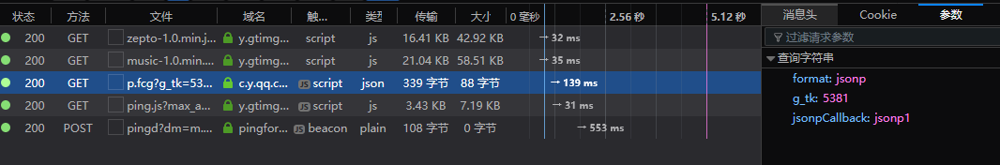
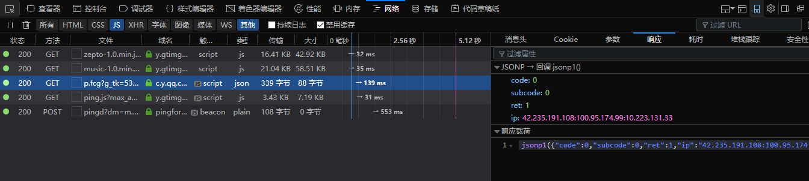
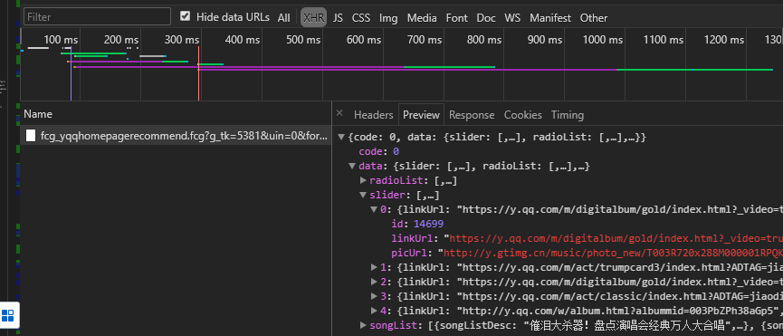

index.html

**移动端的惯例添加**
```JavaScript
 <meta name="viewport" content="width=device-width,initial-scale=1.0,maximum-scale=1.0,minimum-scale=1.0,user-scalable=no">
 ```
>- width - viewport的宽度 height - viewport的高度
>- initial-scale - 初始的缩放比例
>- minimum-scale - 允许用户缩放到的最小比例
>- maximum-scale - 允许用户缩放到的最大比例
>- user-scalable - 用户是否可以手动缩放

[在移动浏览器中使用viewport元标签控制布局](https://developer.mozilla.org/zh-CN/docs/Mobile/Viewport_meta_tag)

[viewport标签](https://www.cnblogs.com/2050/p/3877280.html)

### 添加依赖
package.json

- babel-runtime
- fastclick [解决移动端点击300毫秒延迟](https://www.jianshu.com/p/16d3e4f9b2a9)
- babel-polyfill 对es6的api进行转义例如promise

>问题什么是babel?

[babel](http://www.ruanyifeng.com/blog/2016/01/babel.html)

>npm i babel-runtime fastclick babel-polyfill

      在main.js 中import babel-polyfill

```JavaScript
import 'babel-polyfill' //一定要写到最开始的 babel-runtime 是不用写在代码中,在编译过程中自动调用
import fastclick from 'fastclick'
/* 去掉300毫秒的延时 */
fastclick.attach(document.body)//推荐用法
```
  [fastclick参考](https://github.com/ftlabs/fastclick)

#   实现m-header组件
*  位置
    *  ./components/m-header/


variable 中定义了一些通用的规范 字体 颜色,导入之后就可以用了(例如:$color-background)

mixin 中定义了一些方法 bg-img 将logo图片导入

在APP.vue 引入组件m-header.vue

```JavaScript
<template>
  <div id="app">
      <m-header></m-header>
    <!-- <router-view/> -->
  </div>
</template>

<script type="text/ecmascript-6">
import MHeader from 'compontents/m-header/m-header'
export default{
  components:{
    MHeader
  }
}
</script>

```

>NOTE: 命名: 将m-header的组件名在注册组件的时候换成了驼峰命名
>
>html中大小写不敏感m-header 在js当中m-header不支持只能用驼峰


webpack.base.conf.js
别名的配置
```JavaScript
  resolve: {
    extensions: ['.js', '.vue', '.json'],
    alias: {
      '@': resolve('src'),
      'common':resolve('src/common'),
      'components':resolve('src/components'),
    }
  },
```
# 2.1 路由配置和顶部组件


创建4个空组件

rank
recommend
search
singer
tab

删掉脚手架helloword中不必要的代码 一个模板复制粘贴
```JavaScript
import Rank from 'components/rank/rank'
import Recommend from 'components/recommend/recommend'
import Search from 'components/search/search'
import Singer from 'components/singer/singer'
//...
 routes: [
    {
      path: '/',
      name: 'Recommend',
      component: Recommend
    }
  ]
```

注意 routes component 单词不要写错

```html
 <router-link class="tab-item" tab="div" to="/recommend"><span class="tab-link">推荐</span></router-link>
   <router-link class="tab-item" tab="div" to="/singer"><span class="tab-link">歌手</span></router-link>
   <router-link class="tab-item" tab="div" to="/rank"><span class="tab-link">排行</span></router-link>
   <router-link class="tab-item" tab="div" to="/search"><span class="tab-link">搜索</span></router-link>
```
>router-link 中的tab 标签可以定义其渲染的标签 默认是a,当前定义的是div

在style 中定义的

```css
&.router-link-active
        .tab-link
          color: $color-theme
          border-bottom: 2px solid $color-theme
```
当router-link被激活的时候router-link-active


### 在APP.vue中
```JavaScript
import MHeader from 'components/m-header/m-header'
import Tab from 'components/tab/tab'
export default{
  components: {
    MHeader,
    Tab
  }
}
```

## 总结一下

1. 定义组件 template script style
2. 配置路由
3. 在APP.vue中引入并且注册组件


设置路由的默认路径
```JavaScript
   {
      path: '/',
      name: 'Recommend',
      component: Recommend
    },
```

## 从[qq音乐](https://m.y.qq.com/)获取数据


#### 我们接下来想做的事情就是,从QQmusic官网上获取到我们的轮播图的数据


1. 登录QQmusic官网,F12打开浏览器的 console

2. 切换到Network分栏,下面有一些数据的分类
    * XHR  也就是ajax请求
    * **JS** 选项卡下找到fcg开头的js 不是通常js脚本,它其实是一些数据,实际上返回的是一些jsonp

## jsonp解决跨域问题

## jsonp的原理
1. jsonp之所以能够解决跨域问题是因为,它不是一个ajax请求,是利用动态创建的是script标签script标签没有同源策略限制的,是可以跨域的
2. 通过创建script标签,将其指向请求服务端地址

>这个地址和普通ajax地址有什么不一样的地方?

    这个地址后面通常有个参数叫做callback=a,这样服务端就可以解析到,这样服务端就可以在a中包裹一段数据,然后在前端执行a这个方法,那么在此之前前端是没有a这个方法的,所以我们需要在发送请求之前,在前端定义这个方法,这样在服务端返回的执行这个a方法我们就可以获取a方法中的数据

    jsonp 有空看下源码 https://github.com/webmodules/jsonp
***
jsonp(url, opts, fn)

- url (String) url to fetch
- opts (Object), optional
  - param (String) name of the query string parameter to specify the callback (defaults to callback)
  - timeout (Number) how long after a timeout error is emitted. 0 to disable (defaults to 60000)
  - prefix (String) prefix for the global callback functions that handle jsonp responses (defaults to __jp)
  - name (String) name of the global callback functions that handle jsonp responses (defaults to prefix + incremented counter)
- fn callback

The callback is called with err, data parameters.

If it times out, the err will be an Error object whose message is Timeout.

Returns a function that, when called, will cancel the in-progress jsonp request (fn won't be called).

***
### NOTE:
1. opts 中有一个是回调函数,也就是后端与前段预定一个字段作为回调 默认是callback

> 问题是怎么寻找约定的callback字段?

通过下面的两幅图可以知道 qqmusic 预定字段是
- 一般在console中js XHR html 其他这个几个选项卡中的请求链接
- 在链接中需找带有.fcg的请求路径
- jsonpCallback:jsonp1
- response: jsonp1(....)开头的所以,字段就是jsonp1




>1. 那么问题就是.fcg是什么文件?为什么通过其可以找到jsonp的请求?
>2. jsonp的原理是什么?
>3. 为什么jsonp可以解决跨域问题?
>4. 解决跨域问题只有这一条路吗?
***
我希望通过这种自问自答的形式提醒自己 :
* 只有发现有价值的问题才能开始思考
* 也只有通过连续发现有价值的问题才能深入思考
***
callback 以后会改成promise实现

引用 jsonp

## 对jsonp做一个封装

* 为什么要对jsonp做封装?
1. jsonp插件参数不符合常见的调用习惯(一个干净的url + data(object 参数对象))
2. jsonp没有实现promise调用
3. 没有做参数校验,错误处理

```JavaScript
import originJSONP from 'jsonp'
/**
 *
 * @param {*} url 通常向服务端传入URL是带参数的,jsonp 是不支持传入object data的
 * 需要先将url带上参数拼接好才能传入jsonp库,而为了便于我们的使用,我们希望url是一个比较纯净的地址
 * 使用data传入参数
 * @param {*} data
 * @param {*} option
 */
export default function jsonp (url, data, option) {
  url += (url.indexof('?') < 0) ? '?' : '&' + param(data)
  return new Promise((resolve, reject) => {
    originJSONP(url, option, (err, data) => {
      if (!err) {
        resolve(data)
      } else {
        reject(err)
      }
    })
  })
}
/**
 *将传入的data对象也就是将要传入的url参数放入到url当中
 */

function param (data) {
  let url = ''
  for (const k in data) {
    let value = data[k] !== undefined ? data[k] : ''
    // 将参数添加到url之后
    url += `&${k}=${encodeURIComponent(value)}`
  }
  // 需要删除多余的&
  return url ? url.substring(1) : ''
}
```

tip：

  * for in 遍历数组返回的是 索引
    遍历对象返回的是属性名
    [数组遍历方法](http://www.xugaoyang.com/post/5a62fb1d1d92b0371315ab35)
  * url += `&${k}=${encodeURIComponent(value)}
  > 其中${k} <=> "+ k +" 连字符
  * 注意 ` ` ES6语法,这个还是键盘上Esc下的符号,这个是字符串模板使用这个可以,粘贴大段可以保留换行以及缩进
  * encodeURIComponent可以将字符特别是中文字符进行十六进制编码
  * url += (url.indexof('?') < 0) ? '?' : '&' + param(data) 这是url字符串拼接的高频小套路

下面的也是高频小套路
   ```JavaScript
   function param (data) {
  let url = ''
  for (const k in data) {
    let value = data[k] !== undefined ? data[k] : ''
    // 将参数添加到url之后
    url += `&${k}=${encodeURIComponent(value)}`
  }
  // 需要删除多余的&
  return url ? url.substring(1) : ''
}
```
* promise的使用,将一个普通函数封装成promise函数

TODO: 这里需要补一个链接,详细介绍下promise
```JavaScript
new promise((resolve,reject) => {

})
```

# part 2.2 使用jsonp抓取数据

1. 给每个部分封装获取相关数据的方法

recommend


import jsonp from "common/js/jsonp.js"


细节

1. 这里引用的时候没有加{ }是因为定义的时候没有使用default 如果定义js 使用export 中只有一个函数就可以加上default,在import 的时候就不用家{ }因为在上面模块中就定义了一个函数
2. 如果在函数中顶一个多个 export cost aaa 我们在引用的时候 import 就需要添加 {函数/变量名称,... }


通过抓取多个接口发现 qqmusic 有些接口的参数是不变的也就是公用参数,可以新建一个公用的参数工具,
这样就避免为每一个请求重复定义一些同样的参数

```JavaScript
export const commonParmas = {
  g_tk: 5381,
  inCharset: 'utf-8',
  outCharset: 'utf-8',
  format: 'json',
  notice: 0,
  needNewCode: 1,
  uin: 0
}
export const options = {
  params: 'jsonpCallback'
}
// 所有接口返回值 code:0,我们配置了一个更语义化的常量
export const ERR_OK = 0
```
合并两个对象中的属性

object2 = Object.assign({},object1)
[Object.assign](https://developer.mozilla.org/en-US/docs/Web/JavaScript/Reference/Global_Objects/Object/assign)

```JavaScript
// recommend.js 定义推荐组件获取数据
import jsonp from 'common/js/jsonp'
import {commonParmas, options} from './config'
export function getRecommend () {
  const url = 'https://c.y.qq.com/musichall/fcgi-bin/fcg_yqqhomepagerecommend.fcg'
  // Object.assign将对象和一堆参数合并成一个对象
  const data = Object.assign({}, commonParmas, {
    needNewCode: 1,
    platform: 'h5',
    uin: 0
  })
  return jsonp(url, data, options)
}
```

# part2.3 再做一个轮子实现一个轮图组件

新建一个基础组件文件夹 base目录 与components 组件同级
/src/base/slider
轮播图是一个相对比较基础的组件,可以将其放入base文件夹中,这样项目中就有了两个组件库
* 基础组件库base
* 业务组件库components

一个项目中允许有多个package.js 吗?
可以将组件中单独安装依赖吗?
base文件夹中使用


## 在recommend组件中引用 slider组件

### 在Recommend组件中做一些修改

* 将jsonp获取的数据存放到data当中
* 在recommend组件中引用的slider中遍历数据

```JavaScript
 methods: {
    _getRecommend() {
      getRecommend().then(res => {
        if (res.code === ERR_OK) {
          console.log(res.data.slider)
          this.recommends = res.data.slider
        }
      })
    }
  },

```

照着下面的参数将recommend组件中的slider组件完善


```html
 <div class="recommend">
   <div class="recommend-content">
     <div class="slider-wrapper">
         <!-- 放到slider组件的插槽中 -->
       <slider>
          <div v-for="item in recommends" :key="item.id">
            <!-- 从获取的数据可以得到linkUrl -->
            <a :href="item.linkUrl">
              
            </a>

          </div>
       </slider>
       <!-- ... -->
```

完成之后可以成功的看到图片但是样式不对


使用 [better-scroll](https://github.com/ustbhuangyi/better-scroll)
```javascript
<script>
export default {
  props: {
    loop:{
      type: Boolean,
      default: true
    },
    autoPlay: {
      type: Boolean,
      default: true
    },
    interval: {
      type: Number,
      default: 4000
    }
  }
}
</script>
```
限制传入的值以及设定默认值

注意初始化的时机
* 初始化不能滚动,初始化报错原因是初始化时机不对,组件没有在初始化时渲染,或者设置组件的宽度或者高度不对
* 需要在我们slider dom-ready的时候初始化
* 使用mounted这个钩子
* 设置setTimeout 为20毫秒,浏览器一般是17毫秒刷新一次,设置时间太短了slider不会刷新,是一个经验值
* 建议将大段的代码放到一个methods中,否则会难以维护

 [设置ref是怎么回事?](https://cn.vuejs.org/v2/guide/components.html#子组件引用)
```html
  <div class="slider" ref="slider">
  <div class="slider-group" ref="sliderGroup">
```
tip:

import { Bscorll as B } from 'better-scroll' 还可以加别名

```JavaScript
<script type="text/ecmascript-6">
import BScroll from 'better-scroll'
import { addClass } from 'common/js/dom'
export default {
  props: {
    loop: {
      type: Boolean,
      default: true
    },
    autoPlay: {
      type: Boolean,
      default: true
    },
    interval: {
      type: Number,
      default: 4000
    }
  },
  mounted() {
    setTimeout(() => {
      this._setSliderWidth()
      this._initSlider()
    }, 20)
  },
  methods: {

    /**
     *     //需要计算slider的宽度,这里的slider是横向的
     *1. 首先需要先获取slider下面的列表到底有多少个元素
     *2. 然后初始化sliderGroup的宽度 width = 0 随后用计算结果赋值
     *3. 获得slider的宽度这个是被里面图片撑开,即获取里面图片宽度即可
     *4. 使用循环计算sliderGroup的宽度并赋值给width
     *      1.现获取到每个子元素child
     *      2.位每个子元素添加class属性,添加class的方法addClass已经抽离成公用方法了
     *      3.每个child设置宽度
     *5. 如果this.loop是true,接下来会初始化loop
          1.实际上是clone两个dom,为了保证循环切换
          2. 需要加两倍的sliderwith

     *
     *
     */
    _setSliderWidth() {
      this.children = this.$refs.sliderGroup.children
      let width = 0
      let sliderWidth = this.$refs.slider.clientWidth
      for (let i = 0; i < this.children.length; i++) {
        let child = this.children[i]
        addClass(child, 'slider-item')

        child.style.width = sliderWidth + 'px'
        width += sliderWidth
      }
      if (this.loop) {
        width += 2 * sliderWidth
      }
      this.$refs.sliderGroup.style.width = width + 'px'
    },
    _initSlider() {
      this.slider = new BScroll(this.$refs.slider, {
        scrollX: true,
        scrollY: false,
        momentum: false,
        snap: true,
        snapLoop: this.loop,
        snapThreshold: 0.3,
        snapSpeed: 400,
        click: true
      })
    }
  }
}
</script>


```

为child 添加样式
写一个dom操作的一些通用方法
```javascript
// 这里写一些dom操作的通用方法,将一些比较常用的方法抽象出来
// el,dom对象
/**
 * @param {*} el dom 对象
 * @param {*} className
 */
export function addClass(el, className) {
  if (hasClass(el, className)) {
    return
  }
  let newClass = el.className.split(' ')
  newClass.push(className)
  el.className = newClass.join(' ')
}
/**
 * @export 如果已经有,className需要一个方法判断是否存在className
 * @param {any} el
 * @param {any} className
 * 1. 使用正则判断
 */
export function hasClass (el, className) {
  let reg = new RegExp('(^|\\s)' + className + '(\\s|$)')
  return reg.test(el.className)
}
```

import { addClass } from 'common/js/dom';


问题:

>当一切都完成刷新页面却没有正确显示尺寸?怎么去定位问题?

1. slider组件的加载时机是mounted setSliderWidth
2. 在recommend组件引用了slider
3. recommend的引用时机是在created时候去getRecommend获取数据,
4. 在getRecommend是一个异步过程会有几百毫秒到几秒的延迟,在其还没有获取到数据的时候
5. 这个时候slider中的mounted已经执行了,这个时机不对了
6. 我们为了确保slider插件中的slot有数据,才能正确的计算里面的尺寸
7. 我们需要在Recommend组件加一个判断等待,v-if=recommend.length有数据的时候再去渲染下面的dom


##   初始化slider

```JavaScript
    _initSlider() {
      this.slider = new BScroll(this.$refs.slider, {
        scrollX: true,
        scrollY: false,
        momentum: false,
        snap: true,
        snapLoop: this.loop,
        snapThreshold: 0.3,
        snapSpeed: 400,
        click: true
      })
    }
```
# part2.4完善slider组件

添加dots自动轮播
* 通过页面元素审查发现轮播图中有7个元素,但是我们获取的数据是5个图片
  原因是初始化slider,为了实现无缝滑动会为子元素clone两张
* dots也就是在图片上有几个点,必须在初始化slider之前初始化dos
* 定义一个_initDots()的方法

```javascript
   _initDots() {
      // dots 是图片上的小圆点,在下面顶一个长度为children.length的空数组
      this.dots = new Array(this.children.length)
    }
```
## 滚动当前页圆点放大

```html
  <span class="dot" v-for="(item, index) in dots" :key="index"

   :class="{active:currentPageIndex==index}"
```

* :class="{active:currentPageIndex===index}"
* 注意在html标签内写的是{{ }}
* 这里用的是一个表达式,而且是用的是单大括号
* 当表达式为true则active 标签被激活

```css
&.active {
        width: 20px;
        border-radius: 5px;
        background: $color-text-ll;
      }
```
定义变量
currentPageIndex: 0

维护currentPageIndex 将滚动到某一页与其关联
* better-scroll 在滚动的时候会派发一个事件的
* 可以在初始化initSlider定义一个事件

```javascript
       /**
        * 维护currentPageIndex 将滚动到某一页与其关联
        * better-scroll 在滚动的时候会派发一个事件的
        * 可以在初始化initSlider定义一个事件
        * 如果在loop模式下默认会在第一个和最后一个元素中添加2个元素
        * 则pageIndex -=1
        */
      this.slider.on('scrollEnd', () => {
        let pageIndex = this.slider.getCurrentPage().pageX
        if (this.loog) {
          pageIndex -=1
        }
        this.currentPageIndex = pageIndex
       })
```

自动播放


```javascript
    _play() {
      let pageIndex = this.currentPageIndex + 1
      if (this.loop) {
        // 和上面的逻辑是一样的,因为有副本的缘故
        pageIndex += 1
      }
      // 定义定时器
      this.timer = setTimeout(() => {
        // 切换时使用better-scroll goToPage() 0 代表是y方向的 400毫秒时间间隔
        this.slider.goToPage(pageIndex, 0, 400)
      }, this.interval)
    }
```
