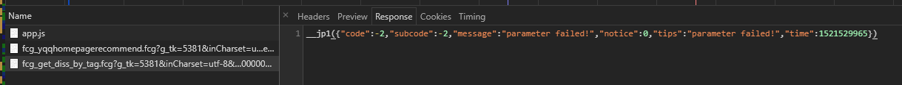
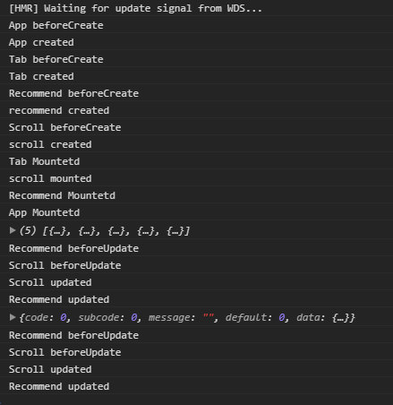

# part3.0 歌单详情页面

经过分析得到这个url

https://c.y.qq.com/splcloud/fcgi-bin/fcg_get_diss_by_tag.fcg


获取歌单数据

recommend.js

```js
export function getRecommend () {/*...*/}
/**
 * 获取歌单数据
 */
export function getDiscList() {
  const url = 'https://c.y.qq.com/splcloud/fcgi-bin/fcg_get_diss_by_tag.fcg'
  // 合并/拼接 公共数据
  const data = Object.assign({}, commonParmas, {
    // picmid: 1,
    rnd: Math.random(),
    loginUin: 0,
    hostUin: 0,
    platform: 'yqq',
    needNewCode: 0,
    categoryId: 10000000,
    sortId: 5,
    sin: 0,
    ein: 29
  })
  return jsonp(url, data, options)
}
```
recommend.vue 引用
```js
import { getRecommend, getDiscList } from 'api/recommend'
// ...
 methods: {
    _getRecommend() {/*...*/},
    _getDiscList() {
      getDiscList().then(res => {
        if (res.code === ERR_OK) {
          console.log(res.data.list)
        }
      })
    }
  }
```
* 定义完成测试却不能正确的得到数据


```js
__jp1({"code":-2,"subcode":-2,"message":"parameter failed!","notice":0,"tips":"parameter failed!","time":1521529965})
```
原因是qqMusic对请求连接的receive和host做了校验,还有跨域的限制
对比第一次请求中response中却没有下面的的值
```js
access-control-allow-credentials:true
access-control-allow-origin:http://y.qq.com
referer:https://y.qq.com/portal/playlist.html
```
> 那么如何绕过校验拿到数据?

使用后端代理
* 在开发的vue项目的时候会启动一个server,这个server
* 可以在dev-server.js中代理这个请求


但是问题是新版本的vue-cli中没有 dev-server.js 和 dev-client.js了


https://github.com/vuejs-templates/webpack/pull/975

问题解决:
http://blog.csdn.net/github_37533433/article/details/78936133

http://blog.csdn.net/qq_34645412/article/details/78833860

[使用before参考webpack文档](https://webpack.js.org/configuration/dev-server/#devserver-before)

## 在webpack.dev.conf.js 配置路由 代理转发获取数据

```js
//通过代理来请求qqmusic 歌单页面
const axios = require('axios')
const express = require('express')
const app = express()
const apiRoutes = express.Router()
//...
 watchOptions: {
      poll: config.dev.poll,
    },


    // 添加before
    before(app){
      apiRoutes.get('/getDiscList', function(req, res) {
        let url = 'https://c.y.qq.com/splcloud/fcgi-bin/fcg_get_diss_by_tag.fcg'
        axios.get(url, {
          headers:{
            referer:'https://c.y.qq.com/',
            host: 'c.y.qq.com'
          },
          // 透传 将 /getDiscList 透传给qqmusic
          params: req.query
        }).then(response => {
          // 透传个我们上一个请求 /getDiscList
          res.json(response.data)
        }).catch(e => console.log(e))
      })
       app.use('/api', apiRoutes)
    }
```

修改 recommend.js
```js
import axios from 'axios'

/**
 * 获取歌单数据
 */
export function getDiscList() {
  const url = '/api/getDiscList'
  // 合并/拼接 公共数据
  const data = Object.assign({}, commonParmas, {
    // picmid: 1,
    rnd: Math.random(),
    loginUin: 0,
    hostUin: 0,
    platform: 'yqq',
    needNewCode: 0,
    categoryId: 10000000,
    sortId: 5,
    sin: 0,
    ein: 29
  })

  return axios.get(url, {
    params: data
  }).then(res => {
    //console.log(res.data)
    return Promise.resolve(res.data)
  })
}
```
我们需要的是一个json

保护接口的策略

* 通过设置host refer 设置过滤
* 接口验证签名
* 封锁出口ip


# 歌单组件

```html
<div class="recommend-list">
       <h1 class="list-title">热门歌单</h1>

        <ul>
          <li class="item" v-for="(item, index) in discList" :key="index">
            <div class="icon">
              
            </div>
            <div class="text">
              <h2 class="name" v-html="item.creator.name"></h2>
              <p class="desc" v-html="item.dissname"></p>
            </div>
          </li>
        </ul>

     </div>
   </div>
```
* v-html

flex 布局
垂直方向上居中
align-items: center;

参考:
[flex 布局](http://www.ruanyifeng.com/blog/2015/07/flex-grammar.html)


# 局部滚动
## 使用 better-scroll

* better-scroll层级是父子级,只有第一个元素才能滚动

* 直接使用 better-scroll组件太繁琐了,像小程序view-scroll组件一样抽象出一个scroll组件

* base/scroll/scroll.vue

* 体现了函数式编程思想与命令式编程

```html
<template>
  <div ref="wrapper">
    <slot></slot>
  </div>
</template>

<script>
  import BScroll from 'better-scroll'
  export default {

    props: {
      probeType: {
        type: Number,
        default: 1
      },
      click: {
        type: Boolean,
        default: true
      },
      data: {
        type: Array,
        default: null
      }
    },
    mounted () {
      // 20毫秒保证组件是在dom渲染之后渲染
      setTimeout(() => {
        this._initScroll()
      }, 20);
    },
    methods: {
      _initScroll() {
        // 如果wrapper不存在则返回
        if(!this.$refs.wrapper) {
          return
        }
        this.scroll = new BScroll(this.$refs.wrapper, {
          probeType: this.probeType,
          click: this.click
        })
      },
      // better-scroll 方法代理
      enable() {
        this.scroll && this.scroll.enable()
      },
      disable() {
        this.scroll && this.scroll.disable()
      },
      // 刷新scroll重新计算高度
      refresh() {
        this.scroll && this.scroll.refresh()
      }
    },

    // 保证组件内部自动刷新 函数式 命令式
    // 使用一个监听器,来监听上面的props中的 data变化, data: function(){} <=> data(){}
    watch: {
      data() {
        setTimeout(() => {
          this.refresh()
        }, 20);
      }
    }
  }
</script>
```

```html
<template>
 <div class="recommend">
   <scroll class="recommend-content" :data="discList">
     <div>
     <div v-if="this.recommends.length" class="slider-wrapper">
         <!-- 放到slider组件的插槽中 -->
       <slider>
          <div  v-for="item in recommends" :key="item.id">
            <!-- 从获取的数据可以得到linkUrl -->
            <a :href="item.linkUrl">
              
            </a>

          </div>
       </slider>

     </div>
     <!--...-->
 ```
 * :data="discList" 在scroll 中绑定歌单数据 是为了在变化的时候重新刷新滚动组件
 * 想想数据加载的时机
 * 让组件内部自己去处理刷新,外部数据更新后组件自己刷新自己,纯组件

 问题是:
 1. 在组件scroll 中定义的props中的data是干什么用的? discList中的数据已经在组件调用者使
    v-for循环出来了? 将discList 使用:data="discList"再穿进去是让整个列表滚动吗?
```html
    <scroll>
      <v-for></v-for>
    </scroll>
```
2. scroll初始化的时机是什么时候?
    * scroll组件是在mounted 的时候初始化的
    * 而scroll中的数据是在它的父组件recommend组件created时机获取的

3. 单个组件的声明周期是按照 created... mounted 以次执行那么多个组件嵌套是怎样执行的?

4. vue的组件App recommend scroll 之间是app 调用 recommend 调用scroll组件那么它们之间的声明周期是怎样的?

        * App组件是vue的一个入口组件
        * App组件中没有注册recommend 和scroll这些组件,但是这些组件最终却呈现到页面当中了
        * 其原因是在App组件中注册了一个Tab的的导航栏组件,导航栏中包含了router-link的类似a标签的
        * 并通过在App中设置出口router-view,和设置router功能使这些未注册的组件却能正确的显示

* 他们之间的生命周期是什么样的?
- 父组件调用子组件,当父组件开始自己的声明周期的时候,就不会立马结束,当父组件created 这个时候子组件也是父组件声明周期中的一部分,也就是说子组件的声明周期没有完成父组件的声明

5. 什么是时候一个组件仅是一个组件显示,什么时候一个组件却可以作为一个页面显示?




