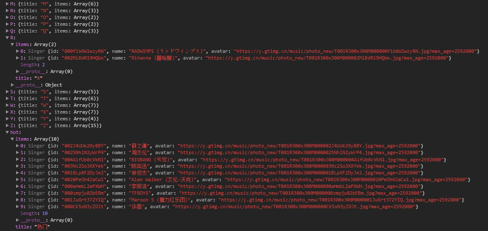

# part4.0 联系人列表-歌手详情页

新建文件
    src/api/singer.js
经过分析从这个连接获取数据
https://c.y.qq.com/v8/fcg-bin/v8.fcg

```js
import jsonp from 'common/js/jsonp'
import {commonParmas, options} from './config'

export function getSingerList() {
  const url = 'https://c.y.qq.com/v8/fcg-bin/v8.fcg'
  const data = Object.assign({}, commonParmas, {
    channel: 'singer',
    page: 'list',
    key: 'all_all_all',
    pagesize: 100,
    pagenum: 1,
    loginUin: 0,
    hostUin: 0,
    notice: 0,
    platform: 'yqq',
    needNewCode: 0
  })
  return jsonp(url, data, options)
}
```
和其recommend.js页面是一样的


## 数据聚合


通过观察发现歌手的头像有一部分数是不变的
这样我们可以将一些有用的数据,放到我们的list当中
例如:

https://y.gtimg.cn/music/photo_new/T001R300x300M000002J4UUk29y8BY.jpg


```js
const HOT_NAME = '热门'
const HOT_SINGER_LEN = 10
//...
    // 构建符合我们列表的数据
    _normalizeSinger(list) {
      let map = {
        hot: {
          title: HOT_NAME,
          items: []
        }
      }
      list.forEach((item, index) => {
        if (index < HOT_SINGER_LEN) {
          map.hot.items.push({
            id: item.Fsinger_mid,
            name: item.Fsinger_name,
            avatar: 'https://y.gtimg.cn/music/photo_new/T001R300x300M000${item.Fsinger_mid}.jpg?max_age=2592000'
          })

        }
        // 生成字母列表
        const key = item.Findex
        if (!map[key]) {
          map[key] = {
            title: key,
            items: []
          }
        }
      map[key].items.push({
        id: item.Fsinger_mid,
        name: item.Fsinger_name,
        avatar: 'https://y.gtimg.cn/music/photo_new/T001R300x300M000${item.Fsinger_mid}.jpg?max_age=2592000'
      })
    });
    }
  ```
创建一个对象将重复的数据放到一个对象当中

创建一个Singer类
```js
export default class Singer {
  constructor({id, name}) {
    this.id = id
    this.name = name
    this.avatar = `https://y.gtimg.cn/music/photo_new/T001R300x300M000${id}.jpg?max_age=2592000`
  }
}
```
```js
// 构建符合我们列表的数据
    _normalizeSinger(list) {
      let map = {
        hot: {
          title: HOT_NAME,
          items: []
        }
      }
      list.forEach((item, index) => {
        if (index < HOT_SINGER_LEN) {
          map.hot.items.push(
          new Singer({
            id:item.Fsinger_mid,
            name:item.Fsinger_name
            })
          )

        }
        // 生成字母列表
        const key = item.Findex
        if (!map[key]) {
          map[key] = {
            title: key,
            items: []
          }
        }
        // 或者这种方式 new Singer (item.Fsinger_mid, item.Fsinger_name) 想一下两种写法那种更好
      map[key].items.push(new Singer ({
        id: item.Fsinger_mid,
        name: item.Fsinger_name,
      }))
    })
    }
  ```
* 上面的map中定义了,有两种对象 一种为hot下面的列表
* 列表中保存了同样的数据只是数据结构的定义方式不一样
* 下面的列表是一个无序的



## 将map排序

```js
 // 为了得到有序列表,需要处理map
      /**
       * 1. 将map,根据title的值分成两份
       * 2. 字母列表放到ret数组中,title值为 HOT_NAME
       * 3.
      */
      let hot = []
      let ret = []
      for (let key in map) {
        let val = map[key]
        if (val.title.match('[a-zA-Z]{1}')) {
          ret.push(val)
        } else if (val.title === HOT_NAME) {
          hot.push(val)
        }
      }
      ret.sort((a, b) => {
        // a.title.charCodeAt(0) - b.title.charCodeAt(0) 如果大于零则返回 true
        return a.title.charCodeAt(0) - b.title.charCodeAt(0)
      })
      // 将数组排序后链接到一起
      return hot.concat(ret)
```

```js
    // 构建符合我们列表的数据
    _normalizeSinger(list) {
      let map = {
        hot: {
          title: HOT_NAME,
          items: []
        }
      }
      list.forEach((item, index) => {
        if (index < HOT_SINGER_LEN) {
          map.hot.items.push(
            new Singer({
              id: item.Fsinger_mid,
              name: item.Fsinger_name
            })
          )
        }
        // 生成字母列表
        const key = item.Findex
        if (!map[key]) {
          map[key] = {
            title: key,
            items: []
          }
        }
        // 或者这种方式 new Singer (item.Fsinger_mid, item.Fsinger_name) 想一下两种写法那种更好
        map[key].items.push(new Singer({
          id: item.Fsinger_mid,
          name: item.Fsinger_name
        }))
      })
      // 为了得到有序列表,需要处理map
      /**
       * 1. 将map,根据title的值分成两份
       * 2. 字母列表放到ret数组中,title值为 HOT_NAME
       * 3.
      */
      let hot = []
      let ret = []
      for (let key in map) {
        let val = map[key]
        if (val.title.match('[a-zA-Z]{1}')) {
          ret.push(val)
        } else if (val.title === HOT_NAME) {
          hot.push(val)
        }
      }
      ret.sort((a, b) => {
        // a.title.charCodeAt(0) - b.title.charCodeAt(0) 如果大于零则返回 true
        return a.title.charCodeAt(0) - b.title.charCodeAt(0)
      })
      // 将数组排序后链接到一起
      return hot.concat(ret)
    }
```

# 类通讯录的组件

创建文件
/src/base/listview/listview.vue


```html
<template>
  <scroll class="listview" :data="data">
    <ul >
      <li class="list-group" v-for="(group, index) in data" :key="index" >
        <h2 class="list-group-title">{{group.title}}</h2>
        <ul>
          <li class="list-group-item" v-for="(item, index) in group.items" :key="index">
            
            <span class="name">{{item.name}}</span>
          </li>
        </ul>
      </li>
    </ul>
  </scroll>
</template>
<script>
import Scroll from 'base/scroll/scroll'
export default {
  props: {
    data: {
      type: Array,
      default: null
    }
  },
  components: {
    Scroll
  }
}
</script>
```


## 在singer.vue中引入刚刚定义的组件


```html
import Listview from 'base/listview/listview'

<template>
 <div class="singer">
   <listview :data="singers"/>
</div>
</template>
```

## 使用懒加载

```js
 v-lazy="item.avatar"
```

